# Facial recognition without code

        

Today, we are going to build an event-driven application to consume photos, identify the photos by anonomous ID, and store basic data about each in a SQL database. In order to accomplish this, we are going to use the following parts of Azure's Serverless, AI platform, and managed services:

* Blob Storage
* Event Grid
* Logic Apps
* Cognitive Services
* SQL Database

The application we are building here gets all of the basic functionality up and running which provides a lot of opportunities to extend and expand upon it. At the end we'll provide some links and ideas of ways you can build on this.

## Prerequisites

* To accomplish this lab, you will need an Azure account. Make sure you are able to access Azure and provision resources before you move on.
* It may be helpful to have an empty text file, OneNote, or other place to note things down. We will be handling a lot of configuration details.

## Goal

We will upload images to Azure Blob Storage and use its built in events to emit an event to  Event Grid every time a new image is uploaded. Event Grid will be used to route these events to Logic Apps which will act as the integration engine with Cognitive Services. Based on the blob URL in the Event Grid event, Logic Apps will upload the image to Cognitive Services which will then return a `faceId` to uniquely identify each face as well as some data about the face such as age. This information will then be stored in a SQL Database for querying.

## Guide

### Setup Storage

        

1. Go to the Azure Portal and provision a Storage Account of Kind `StorageV2 (general purposev2)`.

    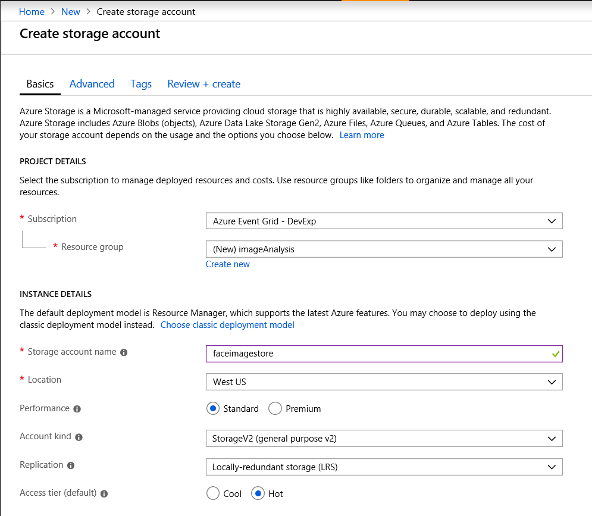

1. Add a blob container to the storage account

    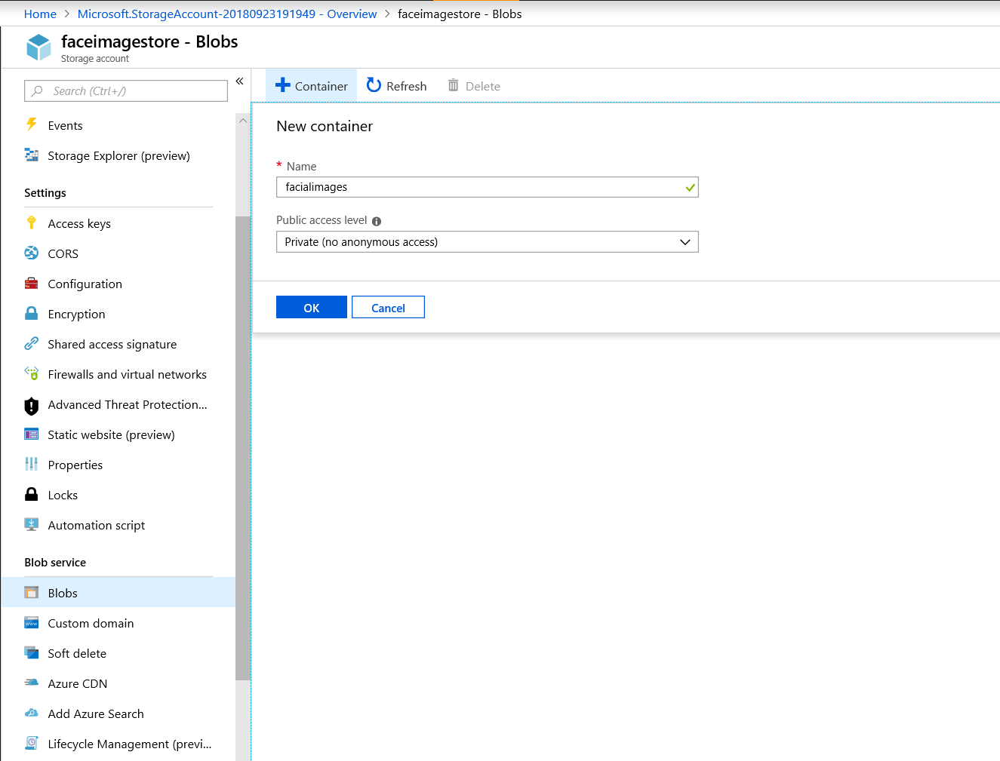

1. Generate a shared access signature for the Blob service. Store the `SAS token` for later.

    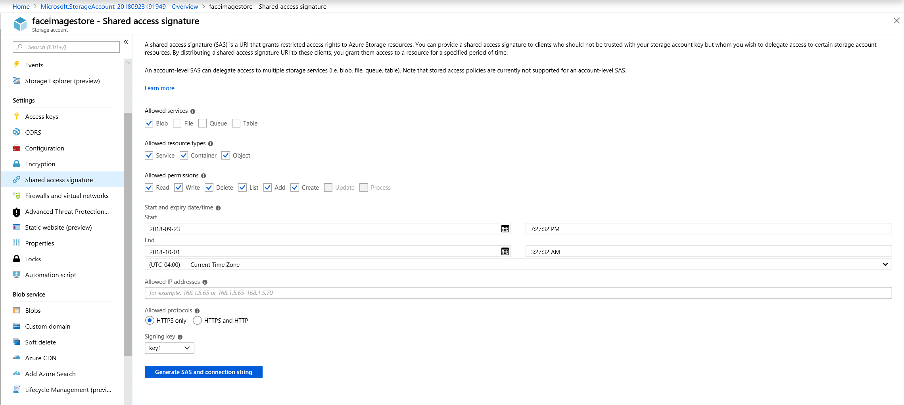

### Add Cognitive Services Face API

        

1. In the portal, click **Create a resource** and search for `Face` to create a Cognitive Services Face API.

    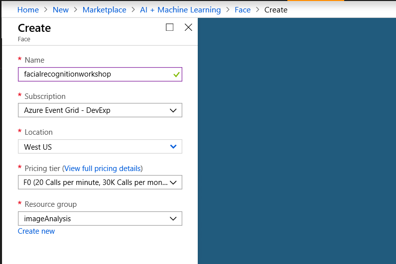

1. Navigate to the overview for the new Cognitive Services Face API instance and copy the `Endpoint` to be used in the Logic App.

    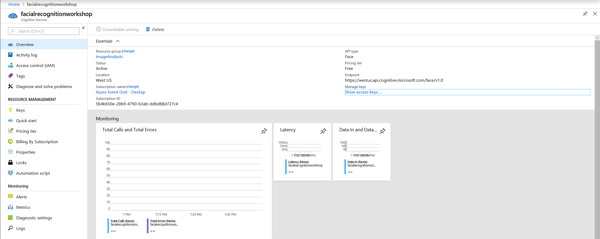

1. Then click **Show access keys...** and copy the `NAME` and `KEY 1` for later.

    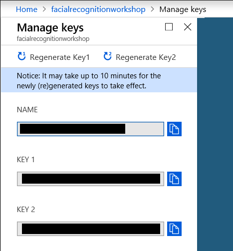

### Setup SQL

        

1. Create a SQL Database. When you create this, you will be asked to select a SQL Server to run it on. Unless you already have one running that you know you can use, you may create the SQL server directly here in the SQL Database create context. Make sure you note your logon information, you will need it later.

    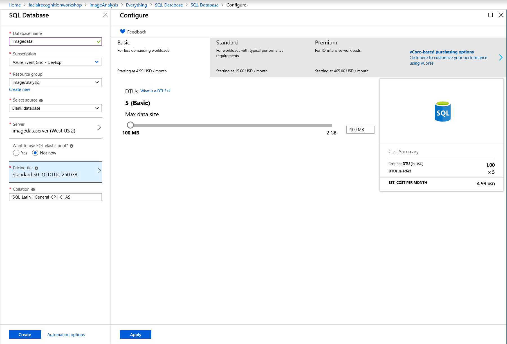

1. [Create a table](https://www.w3schools.com/sql/sql_create_table.asp) by navigating to your SQL Database, selecting **Query editor** from the resource menu, logging in, and running the following query.

    ```sql
    CREATE TABLE AgeDistribution (
        ImageId nvarchar(255),
        Age decimal,
    );
    ```

    Once you have run the query, you may have to refresh the Query editor view of the database to see the newly created table.

    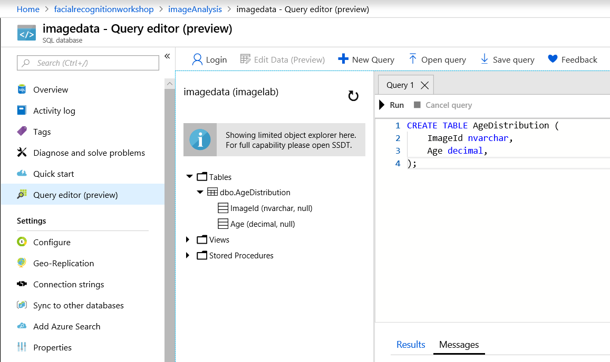

### Connect everything with Logic Apps and Event Grid

        

1. Create a Logic App. We will use this and Event Grid to tie everything together.

    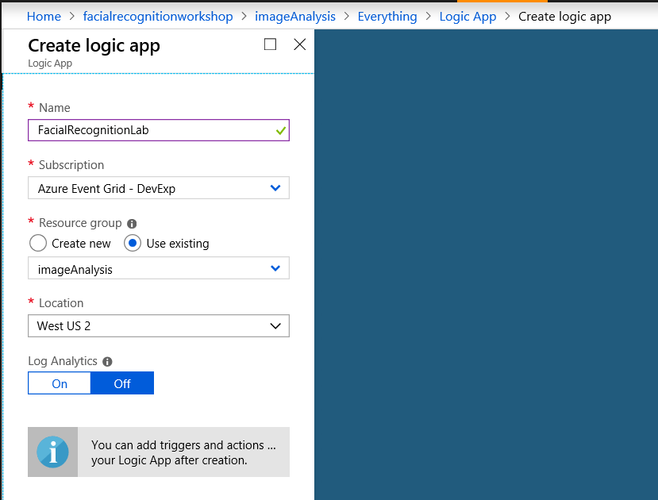

1. Navigate to the Logic Apps Designer and select **When an Event Grid event occurs**.

    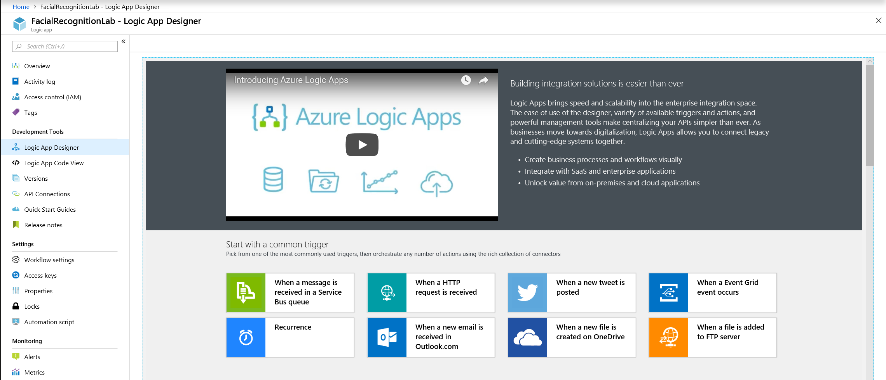

1. Create an Event Subscrition for the Storage Account we made at the beginning of this lab. You may have to login to Logic Apps.

    * Set the Subscription field to the Azure Subscription your resoruces are in.
    * Set the Resource Type to `Microsoft.Storage.StorageAccounts`.
    * Set the Resource Name to the Storage Account you made at the begining of this lab.
    * Click Edit to change the default paramaters and select Eveny Type `Microsoft.Storage.BlobCreated`.
        > We only want to trigger this workflow when we have a file added, not deleted.
    * Click Advanced Options and create a suffix filter for `.jpg`.
        > We don't want to try to run facial recognition on an improperly uploaded file like a text file.
        > If you plan to upload your own photo, make sure it is a .jpg, or you edit/remove this filter accordingly
    * Give your Event Subscription a name.

    

1. Click on + New Step and search for `Parse JSON` to find and add a JSON data parser.

    * Click in the **Content** field and select **Data object** from the options that appear.
    * Select **Use sample payload to generate schema** and copy the data payload of a [Blob Created event](https://docs.microsoft.com/en-us/azure/event-grid/event-schema-blob-storage) into the field and hit **Done**. Here is a sample storage event (you only want the data object):

    ```JSON
    [{
    "topic": "/subscriptions/{subscription-id}/resourceGroups/Storage/providers/Microsoft.Storage/storageAccounts/xstoretestaccount",
    "subject": "/blobServices/default/containers/testcontainer/blobs/testfile.txt",
    "eventType": "Microsoft.Storage.BlobCreated",
    "eventTime": "2017-06-26T18:41:00.9584103Z",
    "id": "831e1650-001e-001b-66ab-eeb76e069631",
    "data": {
        "api": "PutBlockList",
        "clientRequestId": "6d79dbfb-0e37-4fc4-981f-442c9ca65760",
        "requestId": "831e1650-001e-001b-66ab-eeb76e000000",
        "eTag": "0x8D4BCC2E4835CD0",
        "contentType": "text/plain",
        "contentLength": 524288,
        "blobType": "BlockBlob",
        "url": "https://example.blob.core.windows.net/testcontainer/testfile.txt",
        "sequencer": "00000000000004420000000000028963",
        "storageDiagnostics": {
        "batchId": "b68529f3-68cd-4744-baa4-3c0498ec19f0"
        }
    },
    "dataVersion": "",
    "metadataVersion": "1"
    }]
    ```

    * The resulting JSON schema should be:

    ```JSON
    {
        "type": "object",
        "properties": {
            "api": {
                "type": "string"
            },
            "clientRequestId": {
                "type": "string"
            },
            "requestId": {
                "type": "string"
            },
            "eTag": {
                "type": "string"
            },
            "contentType": {
                "type": "string"
            },
            "contentLength": {
                "type": "integer"
            },
            "blobType": {
                "type": "string"
            },
            "url": {
                "type": "string"
            },
            "sequencer": {
                "type": "string"
            },
            "storageDiagnostics": {
                "type": "object",
                "properties": {
                    "batchId": {
                        "type": "string"
                    }
                }
            }
        }
    }
    ```

    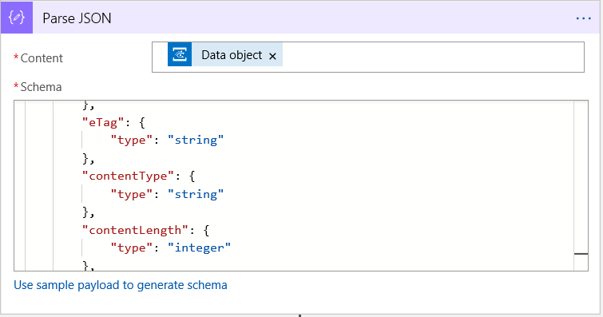

1. Create a new step and search for `Detect Faces` to add a Cognitive Services Face API connection.

    * Add the **Connection Name**, **API Key**, and **Site URL** that you noted down earlier.

    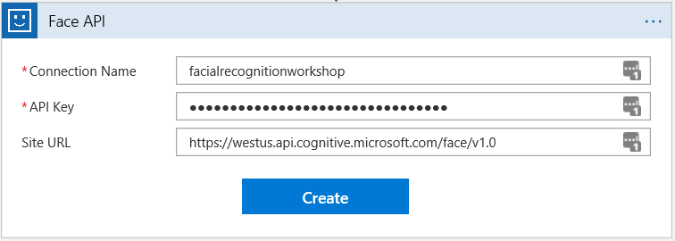

    * Once you hit **Connect** you will be given an **Image URL** field. Click on it and select **URL** from the JSON we parsed in the previous step. This is the path to the Image in blob storage that is sent as part of the data payload in the Event Grid event each time a new blob is uploaded.
    * Take the SAS Token you saved earlier for the storage account and add it to the Image URL. Logic Apps will need this to access the blob. You can paste it in the same field.

    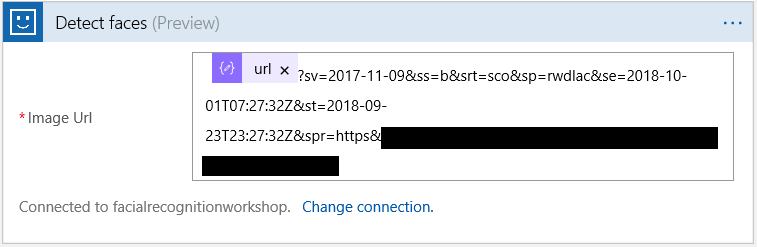

1. Add a for each loop to work over the data sent back for each face in the image.

    * Click on **New Step** then search for `For Each` to add a For Each control.
    * Click in the field for **Select an output for previous steps** and select **Body** from the menu that opens.

    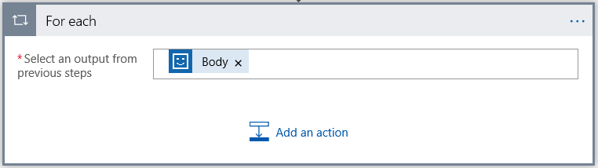

1. Add a row to your SQL Database for each face that the Face API detected in your uploaded image.

    * Click on **Add an action** in the For Each loop.
    * Search for `Insert SQL Row` and select the SQL Server Insert Row action.
    * Create a Connection to your SQL Server and Database
        * Gave a name to your connection, it can be anything you want.
        * Select the SQL Server you created earlier.
        * Select the SQL Database you created earlier.
        * Fill in your **Username** and **Password** for the SQL Database.

        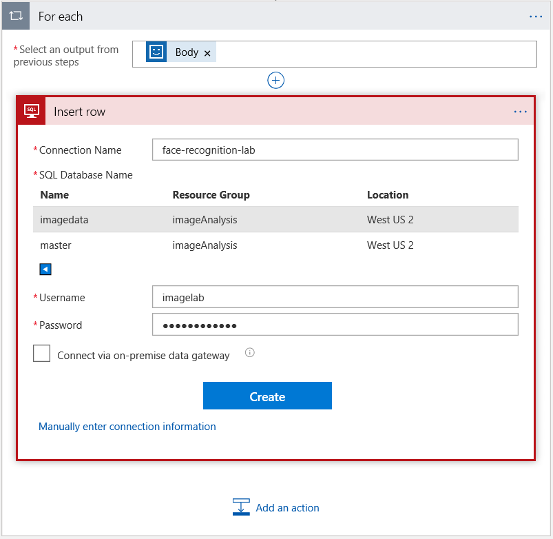

    * Select the table you created earlier from the **Table name** dropdown.
    * Click in **ImageID** and select **Face Id** from the options in the menu that appears.
    * Click in **Age** and select **Age** from the options in the menu that appears.
        > If you created different fields in your SQL table earlier what you see might not match up with this. That is totally ok. Just choose which data you want to have added for which columns.

    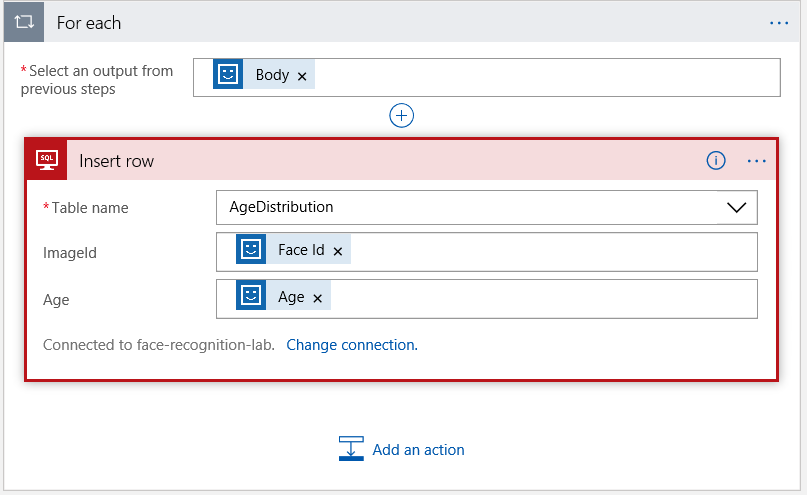

Your finished Logic App should look like this:

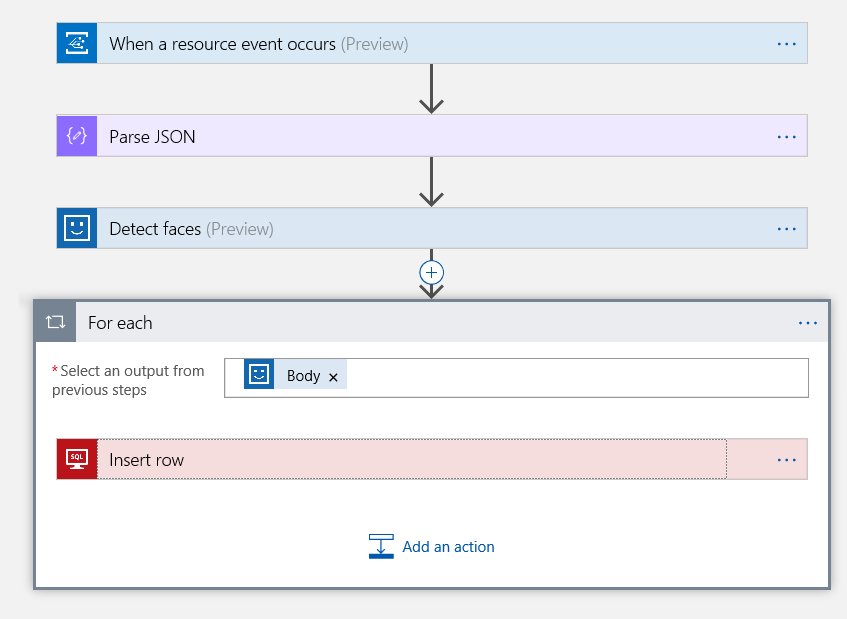

Congratulations! It may not seem like it yet, but your facial recognition app is complete! If you check out the Resource Group you've been working in, it should look something like this with all of your resources in it:

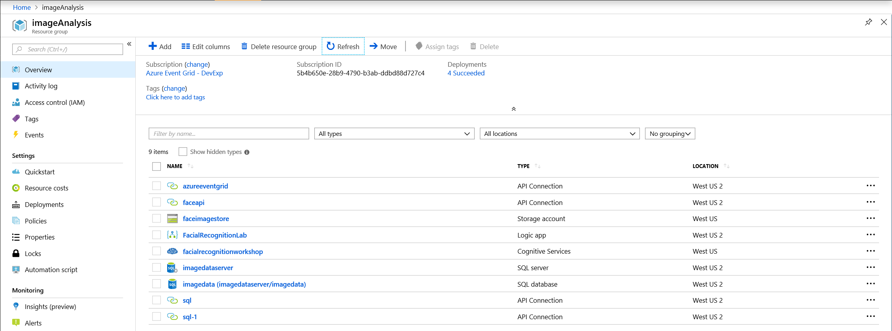

### Test it out

          

Now that we have everything built, lets test it out.

1. We need to start by uploading a photo. You can either use a selfie (make sure it ends in `.jpg` to match the filter we created in the Event Subscription), or you can use a sample photo provided in the [sample-photos folder of the GitHub repository for this lab](https://github.com/Azure-Samples/event-grid-facial-recognition/tree/master/sample-photos).

    * Navigate to the storage account you created at the begining of this lab.
    * Click on **Storage Explorer**.
    * Expand **Blob Containers**.
    * Select the Blob Container you created for this lab.
    * Select **Uplaod**.
    * Choose an image containing a face ending in `.jpg` and upload it to the container.

    

1. Check your Logic App to make sure everything ran smoothly.

    * Navigate to your Logic App Overview.
    * Look at the **Runs History** at the bottom of the overview and click on the most recent one. You should see something like this:

    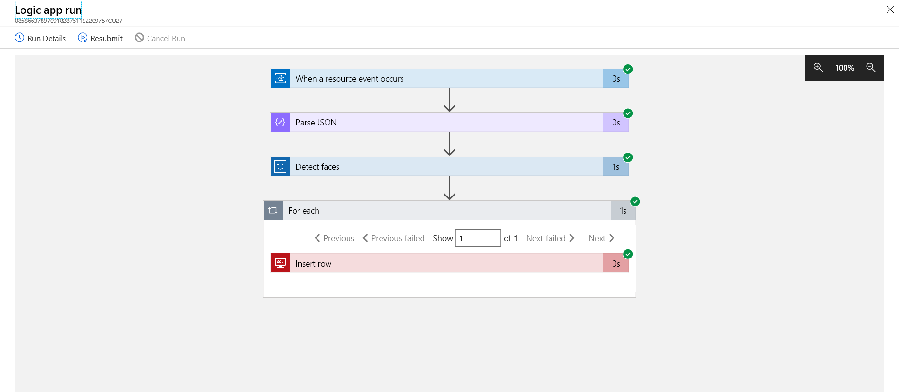

1. Check out the image analysis data in your SQL Database.

    * Navigate to your SQL Database and log in to the Query Editor again.
    * Use the Query editor to check out your data. Try running `select ImageId, Count(*) from AgeDistribution group by ImageId order by 2 asc` to see the count of times each face appeared, or ty running `select Age, Count(*) from AgeDistribution group by age order by 1 asc` to see the count of various age groups appearing in your images.

    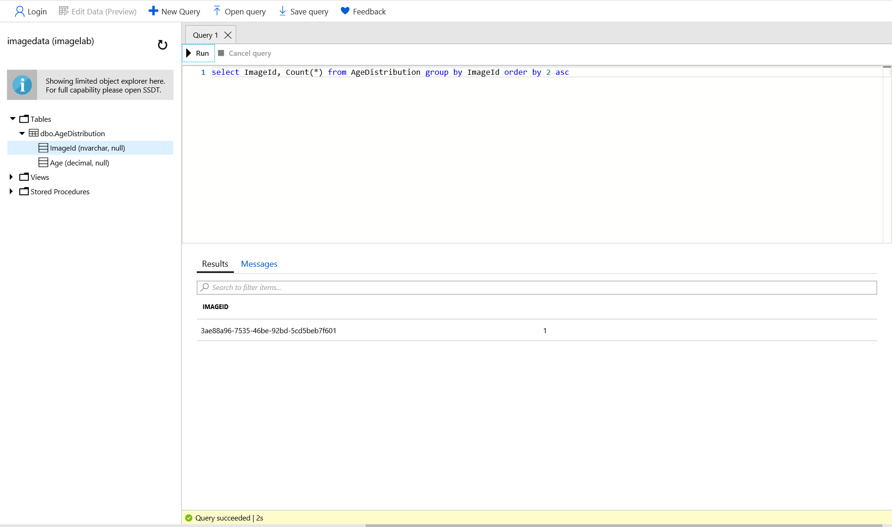

Congratulations! You've now completed the workshop on runing image analysis for facial recognition with no code (well maybe you wrote a few short lines of JSON and SQL).